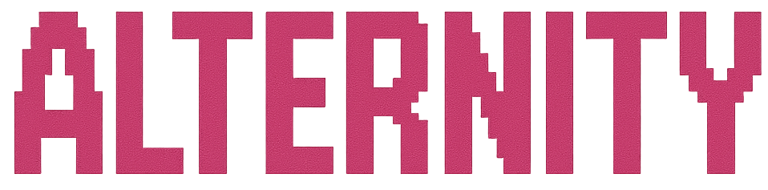

# Alternity Theme for Omarchy



A sophisticated, dark-themed customization for [Omarchy](https://omarchy.org/), meticulously crafted by Alternova. This theme provides a cohesive visual experience across Hyprland, Waybar, terminals, and various applications, featuring deep neutrals, purple accents, and carefully selected backgrounds.

## Screenshots

### Dark Theme:


## Features

- **Comprehensive Theming**: Covers Hyprland window manager, Waybar, Alacritty terminal, Neovim, Starship prompt, and more.
- **Color Palette**: Deep neutrals with purple accents for a modern, professional look.
- **Browser Integration**: Custom themes for Chromium and Brave browsers.
- **VSCode Support**: Includes Catppuccin Mocha theme integration.
- **Curated Backgrounds**: A selection of high-quality wallpapers to complement the theme.

## Backgrounds

This theme includes the following background images:

- `backgrounds/alternity-1.png`
- `backgrounds/alternity-2.png`
- `backgrounds/alternity-3.png`
- `backgrounds/alternity-4.png`
- `backgrounds/alternity-5.png`
- `backgrounds/alternova-1.png`

## Installation

Use the Omarchy built-in theme installer:

```bash
omarchy-theme-install https://github.com/Alternova-Inc/omarchy-alternity-theme
```

After installation, apply the theme:

```bash
omarchy-theme-set alternity
```

## Configuration Files

This theme customizes the following components:

- `alacritty.toml` - Terminal emulator colors
- `btop.theme` - System monitor theme
- `chromium.theme` - Browser color scheme
- `eza.yml` - File manager colors
- `hyprland.conf` - Window manager configuration
- `hyprlock.conf` - Lock screen appearance
- `icons.theme` - Icon theme settings
- `mako.ini` - Notification daemon styling
- `neovim.lua` - Text editor theme
- `starship.toml` - Shell prompt customization
- `swayosd.css` - On-screen display styles
- `vscode.json` - Code editor theme
- `walker.css` - Application launcher styling
- `waybar.css` - Status bar appearance
- `wofi.css` - Application launcher theme

## Contributing

We welcome contributions to improve the Alternity theme! Here's how you can help:

### Reporting Issues
- Found a bug or inconsistency? [Open an issue](https://github.com/Alternova-Inc/omarchy-alternity-theme/issues) with detailed steps to reproduce.

### Suggesting Improvements
- Have ideas for new features or refinements? [Create a feature request](https://github.com/Alternova-Inc/omarchy-alternity-theme/issues).

### Contributing Code
1. Fork the repository
2. Create a feature branch: `git checkout -b feature/your-feature-name`
3. Make your changes and test thoroughly
4. Commit with clear, descriptive messages
5. Push to your fork and [submit a pull request](https://github.com/Alternova-Inc/omarchy-alternity-theme/pulls)

### Guidelines
- Ensure changes maintain the theme's cohesive aesthetic
- Test across different components (Hyprland, Waybar, terminals, etc.)
- Update documentation for any configuration changes
- Follow the existing code style and organization

## License

This project is licensed under the terms specified in the [LICENSE](LICENSE) file.
